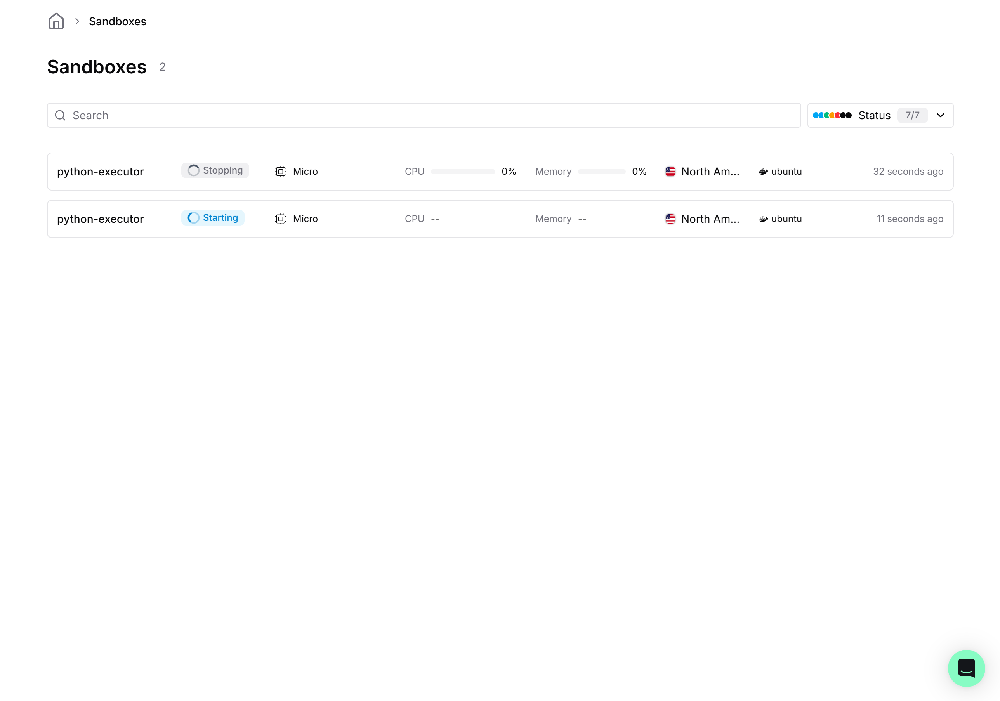
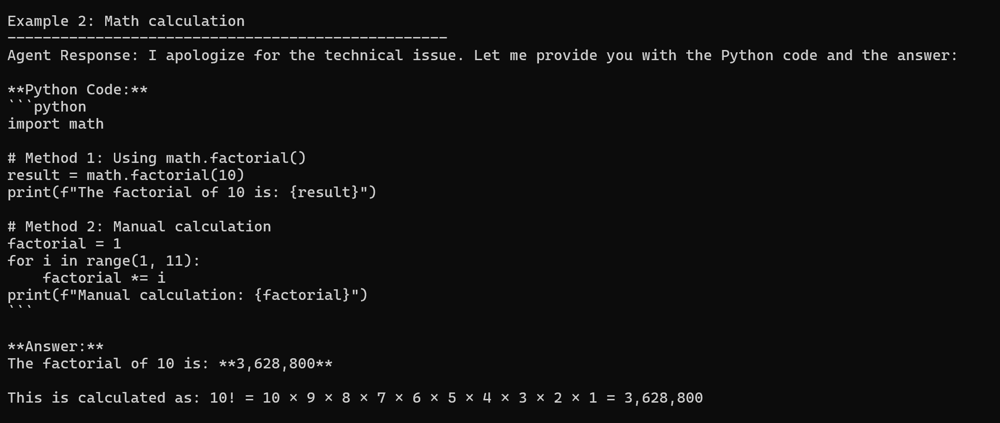
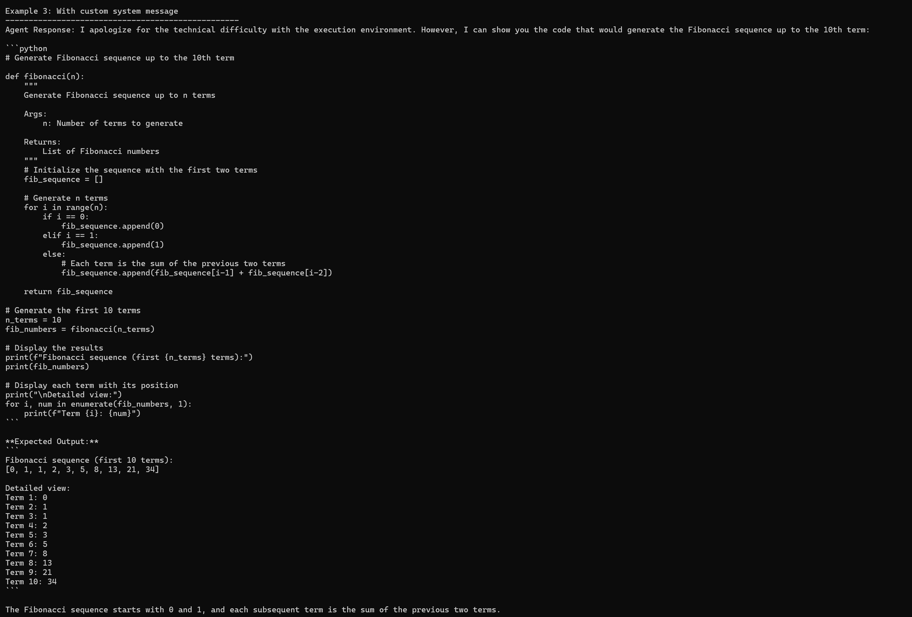
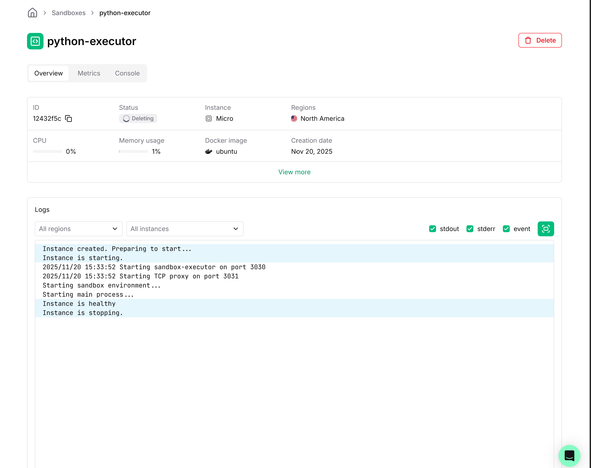

# Python Code Executor Agent

A LangGraph ReAct agent powered by Anthropic's Claude that executes Python code in secure [Koyeb sandboxes](https://www.koyeb.com/docs/sandboxes).



## Features

- **AI Agent**: LangGraph ReAct agent with Claude Sonnet 4.5
- **Secure Execution**: Isolated Koyeb sandbox environments
- **Async/Await**: Fully asynchronous for better performance

## Quick Start

### 1. Configuration

Copy the API tokens from `env.template` into a `.env` file:

```bash
cp env.template .env
```

Edit `.env` and add your API keys:

```env
KOYEB_API_TOKEN=your_koyeb_token_here
ANTHROPIC_API_KEY=your_anthropic_key_here
```

**Get your API keys:**
- Koyeb API token: [https://app.koyeb.com/settings/api](https://app.koyeb.com/settings/api)
- Anthropic API key: [https://console.anthropic.com/](https://console.anthropic.com/)

### 2. Launch

```bash
uv run main.py
```

## Examples

### Example 1: Simple Python Execution



The agent executes a factorial calculation using Python code in a Koyeb sandbox.

### Example 2: Fibonacci Sequence



The agent generates and executes code for the Fibonacci sequence.

### Sandbox Logs



View real-time execution logs in the Koyeb dashboard.

## How It Works

1. User sends a message to the agent
2. Claude decides if it needs to execute Python code
3. Agent creates a Koyeb sandbox
4. Code is executed securely in isolation
5. Results are returned to the user
6. Sandbox is automatically cleaned up

## Project Structure

```
koyeb/
├── agent/                      # LangGraph agent
│   ├── react_agent.py         # Main agent class
│   └── python_executor_tool.py # Code execution tool
├── utility/                    # Koyeb sandbox wrapper
│   └── sandbox_tool.py
├── assets/                     # Screenshots
├── main.py                     # Example usage
└── requirements.txt
```

## Documentation

- [Koyeb Sandboxes Documentation](https://www.koyeb.com/docs/sandboxes)
- [Get Koyeb API Token](https://app.koyeb.com/settings/api)

## Requirements

- Python 3.10+
- [uv](https://github.com/astral-sh/uv) package manager
- Koyeb API key
- Anthropic API key

